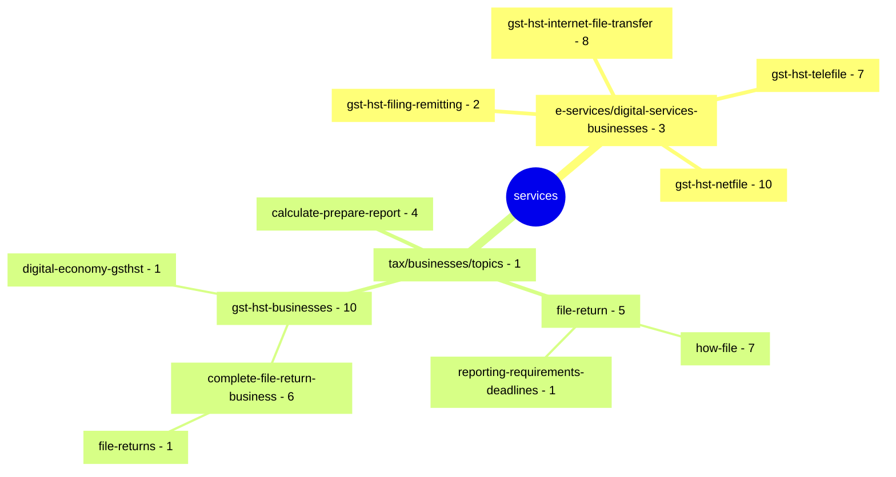

# GST/HST for Small Business [COP FY2024]

Project to optimize the content related to filing GST/HST returns.

**COP Timeframe:** [July 31, 2024 - June 2025]

## Important links

### Page management

- [\[GST COP\] Scoped inventory page \(github\)](https://cra-design.github.io/gst-hst-business/index.html)
- [Added/Deleted/Modified files and pages to be published](https://github.com/cra-design/gst-hst-business/blob/main/docs/CHANGELOG.md)

### Information

- [Design phase roadmap](https://github.com/cra-design/gst-hst-business/blob/main/docs/ROADMAP.md)
- [Contribution guidelines](https://github.com/cra-design/gst-hst-business/blob/main/docs/CONTRIBUTING.md)
- [Support information](https://github.com/cra-design/gst-hst-business/blob/main/docs/SUPPORT.md)
- [Privacy statement](https://github.com/cra-design/gst-hst-business/blob/main/docs/PRIVACY.md)

### Templates

- [Github Canada.ca page template \(Jekyll\)](https://github.com/cra-design/gst-hst-business/blob/main/templates/page_template_jekyll-en.html)
- [Github Canada.ca page template \(CDTS\)](https://github.com/cra-design/gst-hst-business/blob/main/templates/page_template-e.html)
- [Github Canada.ca page template with login \(CDTS\)](https://github.com/cra-design/gst-hst-business/blob/main/templates/page_template_login-e.html)

### Tools

- [Github.dev](https://github.dev/cra-design/gst-hst-business/blob/main/)
- [Convert page to GCWeb/Jekyll page tool](https://cra-design.github.io/core-prototype/core/tools/page-convert-jekyll.html)

## Canada.ca path structure of scoped files

[https://www.canada.ca/en/revenue-agency/services/](https://www.canada.ca/en/revenue-agency/services/e-services/digital-services-businesses/) \[66 pages\]

**Updated:**  2025-06-05
