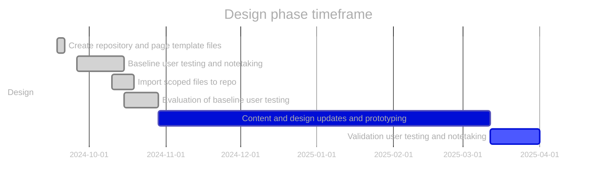
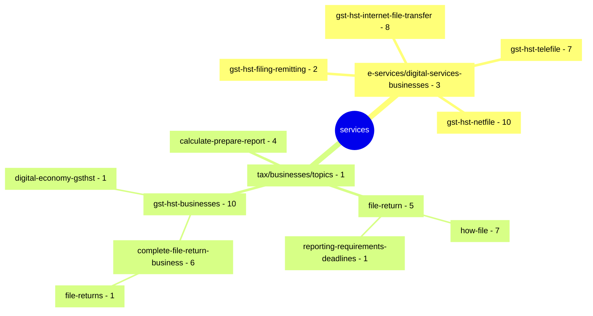

# GST/HST for Small Business [COP FY2024 - FY2025]

Project to optimize the content related to filing GST/HST returns.

**COP Timeframe:** [July 31, 2024 - June 2025]

## Important links

### Page management

- [\[GST COP\] Scoped inventory page \(github\)](https://cra-design.github.io/gst-hst-business/index.html)
- [Added/Deleted/Modified files and pages to be published](https://github.com/cra-design/gst-hst-business/blob/main/docs/CHANGELOG.md)

### Information

- [Design phase roadmap](https://github.com/cra-design/gst-hst-business/blob/main/docs/ROADMAP.md)
- [Contribution guidelines](https://github.com/cra-design/gst-hst-business/blob/main/docs/CONTRIBUTING.md)
- [Support information](https://github.com/cra-design/core-prototype/blob/main/docs/SUPPORT.md)
- [Privacy statement](https://github.com/cra-design/gst-hst-business/blob/main/docs/PRIVACY.md)

### Templates

- [GitHub Canada.ca page template \(Jekyll\)](https://github.com/cra-design/gst-hst-business/blob/main/templates/page_template_jekyll-en.html)
- [GitHub Canada.ca page template \(CDTS\)](https://github.com/cra-design/gst-hst-business/blob/main/templates/page_template-e.html)
- [GitHub Canada.ca page template with login \(CDTS\)](https://github.com/cra-design/gst-hst-business/blob/main/templates/page_template_login-e.html)

### Tools

- [Github.dev](https://github.dev/cra-design/gst-hst-business/blob/main/)
- [Convert page to GCWeb/Jekyll page tool](https://cra-design.github.io/core-prototype/core/tools/page-convert-jekyll.html)

---

## Update procedures:

- Prototype development files will have `_proto#` appended to the end of the filename
- Changes will be committed to the repository by selecting `create a new branch` and then performing a `pull request` to merge the newly updated content
- Updates or pull requests should be named or have comments identifying what has been updated or changed
- Any repository path structure changes should be communicated to all individuals who directly update the repository
- Relative links should not be used on any pages and all links in the repository should be absolute links
- Create and name all files in the locations that reflects what they will be named and where they will be eventually be published when created on Canada.ca
- Follow [Government of Canada domains and URLs - How to write URLs](https://design.canada.ca/specifications/mandatory-elements/domains-urls.html#du3a) guidelines for naming paths and files
- In the [_config.yml](https://github.com/cra-design/gst-hst-business/blob/main/_config.yml) file the `developerOptions:` setting should be changed to `false` before testing takes place

---

## Design phase roadmap:

- [x] Prototype: co-design navigation and content
- [x] SME review and accuracy check
- [x] Validation usability testing (including accessibility review)
- [x] Refine prototype (if required)
- [ ] ~~Spot check usability (if required)~~

\* future dates may be placeholders.

---

## Canada.ca path structure of scoped files

[https://www.canada.ca/en/revenue-agency/services/](https://www.canada.ca/en/revenue-agency/services/e-services/digital-services-businesses/) \[66 pages\]

**Updated:**  2025-06-05
