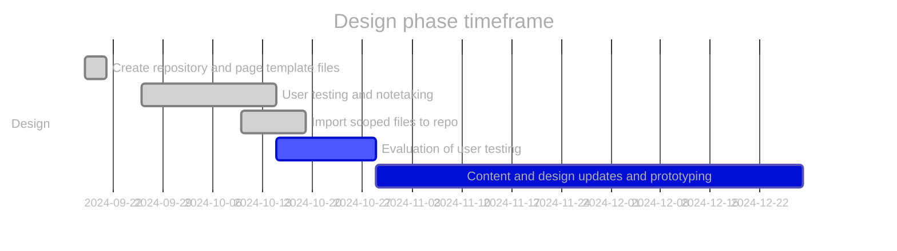
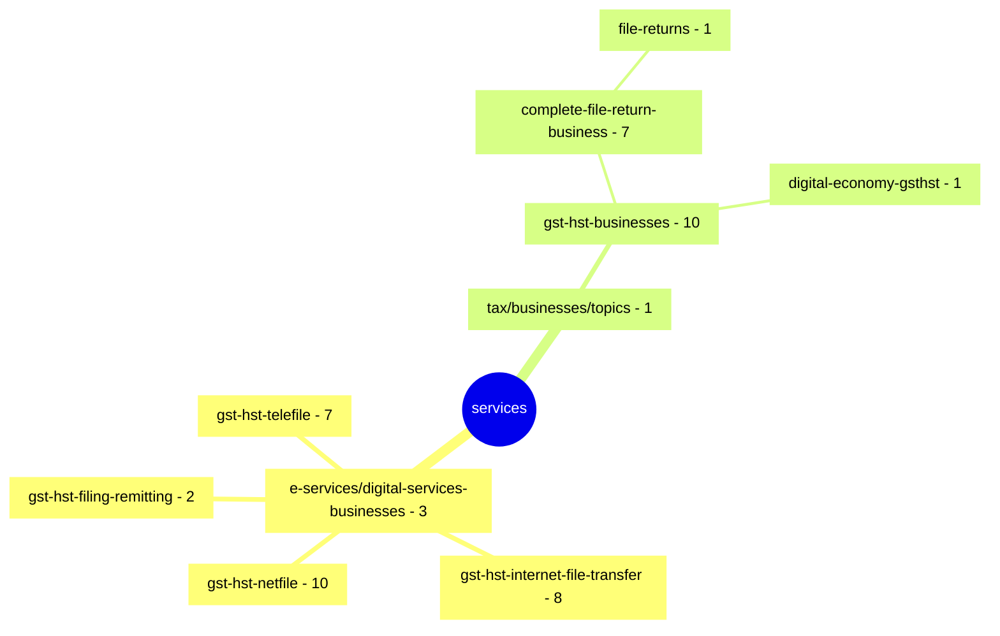

# GST/HST for Small Business [COP FY2024]

Project to optimize the content related to filing GST/HST returns.

**COP Timeframe:** [July 31, 2024 - February 2025]

## Important links

- [\[GST COP\] Scoped inventory page \(github\)](https://cra-design.github.io/gst-hst-business/index.html)
- [Github.dev](https://github.dev/cra-proto/gst-hst-business/blob/main/)
- [Github Canada.ca page template \(Jekyll\)](https://github.com/cra-proto/gst-hst-business/blob/main/templates/page_template_jekyll-en.html)
- [Github Canada.ca page template \(CDTS\)](https://github.com/cra-proto/gst-hst-business/blob/main/templates/page_template-e.html)

## Update procedures:

- Test development files will have `_proto#` appended to the end of the file name
- Changes will be committed by selecting `create a new branch` and then performing a `pull request` to merge the updated content
- Updates should have comments identifying what has been updated
- Any repository path structure changes should be communicated to all indivduals who directly update the repository

---

## Deleted files list

- None

## Design phase roadmap:

- [ ] Prototype: co-design navigation and content
- [ ] SME review and accuracy check
- [ ] Validation usability testing (including accessibility review)
- [ ] Refine prototype (if required)
- [ ] Spot check usability (if required)

\* future dates may be placeholders.

## Canada.ca path structure of scoped files

[https://www.canada.ca/en/revenue-agency/services/](https://www.canada.ca/en/revenue-agency/services/e-services/digital-services-businesses/) \[50 pages\]

**Updated:**  2024-11-06
