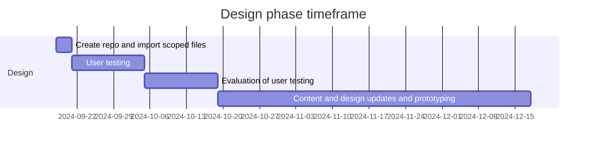
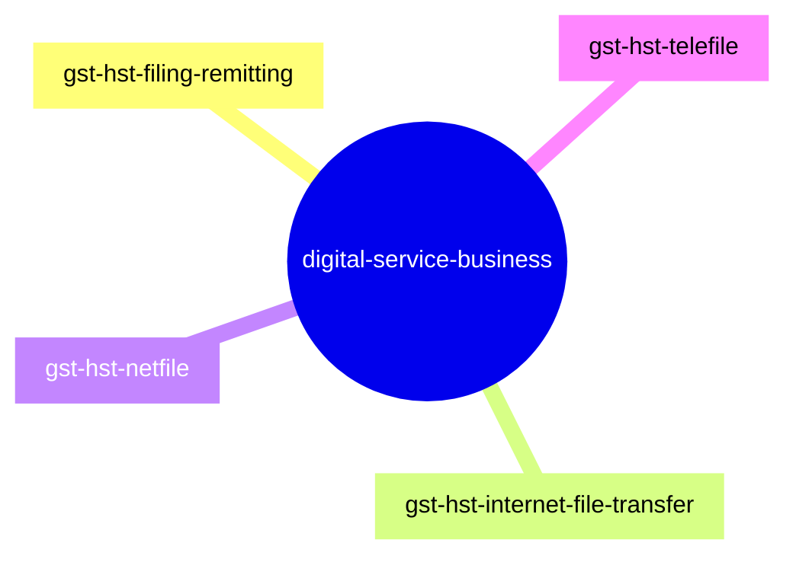

# GST/HST for Small Business [COP FY2024]

Project to optimize the content related to filing GST/HST returns.

**COP Timeframe:** [July 31, 2024 - February 2025]

## Important links

- Live site : [File a GST/HST return, rebate or election electronically](https://cra-proto.github.io/gst-hst-business/en/file-a-gst-hst-return-rebate-election-electronically.html)
- Scoped page list: [GST/HST for Business - scoping](https://122gc.sharepoint.com/sites/WOSCoordination/Lists/GSTHST%20for%20business%20COP%20%20scoping/AllItems.aspx?env=WebViewList&viewid=1379b8f8-af3b-47fb-ba50-29a24ea1d13d&useFiltersInViewXml=1&OR=Teams-HL&CT=1726666893920&clickparams=eyJBcHBOYW1lIjoiVGVhbXMtRGVza3RvcCIsIkFwcFZlcnNpb24iOiI0OS8yNDA4MTcwMDQxOSIsIkhhc0ZlZGVyYXRlZFVzZXIiOmZhbHNlfQ%3D%3D)
- [User Centered Design Guide](https://design.cra-arc.alpha.canada.ca/en/index.html)
- [Toggle Github bookmarklet](javascript:(function(){if(window.location.href.indexOf("github.com")>-1){window.location=window.location.toString().replace(/^https:\/\/github.com\/(.*?)\/(.*?)\/(blob|tree|edit)\/.*?\/(.*?)(\/)?(\.\w+)?$/,%22https://$1.github.io/$2/$4$6%22);}else{var%20i%20=%20%22index.html%22;%20if(window.location.href.indexOf(%22.html%22)%3E-1){i%20=%20%22%22};window.location=window.location.toString().replace(/^https:\/\/(.*?).github.io\/(.*?)\/(.*?)(\/)?(\.\w+)?$/,%22https://github.com/$1/$2/tree/main/$3$5/%22+i).replace(/^https:\/\/test.canada.ca\/(.*?)\/(.*?)(\/)?(\.\w+)?$/,%22https://github.com/gc-proto/$1/tree/master/$2$4/%22+i);}})();) Switches between GitHub edit and GitHub preview.
- [Github Canada.ca page template](https://github.com/cra-proto/gst-hst-business/)

## Github update procedures
- Test development files will be have **"_proto#"** appended to the end of the file name.
- Changes will be committed by **create a new branch** and then performing a pull request to merge the content.
- Updates should have comments identifying the change.

---

## Design phase steps:
- [ ] Prototype: co-design navigation and content
- [ ] SME review and accuracy check
- [ ] Validation usability testing (including accessibility review)
- [ ] Refine prototype (if required)
- [ ] Spot check usability (if required)

## Canada.ca path structure: 
https://www.canada.ca/en/revenue-agency/services/e-services/digital-services-businesses/

**Updated:**  2024-09-18
