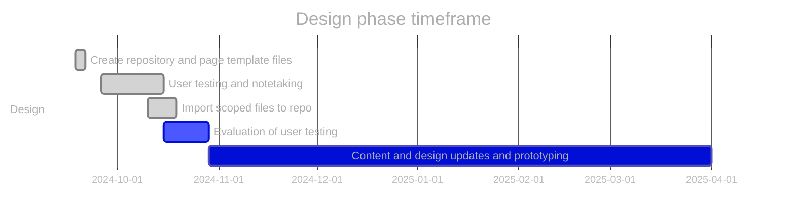
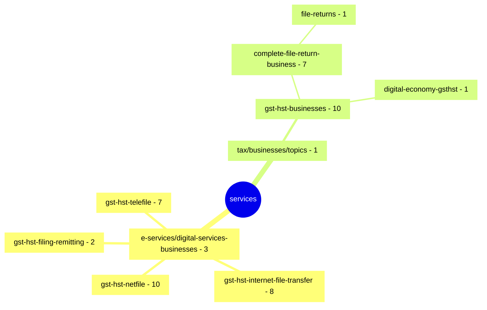

# GST/HST for Small Business [COP FY2024]

Project to optimize the content related to filing GST/HST returns.

**COP Timeframe:** [July 31, 2024 - February 2025]

## Important links

- [Support information](https://github.com/cra-design/gst-hst-business/blob/main/docs/SUPPORT.md)
- [Privacy statement](https://github.com/cra-design/gst-hst-business/blob/main/docs/PRIVACY.md)
- [\[GST COP\] Scoped inventory page \(github\)](https://cra-design.github.io/gst-hst-business/index.html)
- [Github.dev](https://github.dev/cra-design/gst-hst-business/blob/main/)
- [Github Canada.ca page template \(Jekyll\)](https://github.com/cra-design/gst-hst-business/blob/main/templates/page_template_jekyll-en.html)
- [Github Canada.ca page template \(CDTS\)](https://github.com/cra-design/gst-hst-business/blob/main/templates/page_template-e.html)
- [Github Canada.ca page template with login \(CDTS\)](https://github.com/cra-design/gst-hst-business/blob/main/templates/page_template_login-e.html)

## Update procedures:

- Test development files will have `_proto#` appended to the end of the file name
- Changes will be committed by selecting `create a new branch` and then performing a `pull request` to merge the updated content
- Updates should be named or have comments identifying what has been updated or changed
- Any repository path structure changes should be communicated to all indivduals who directly update the repository
- There should be no relative links on any pages so all links should be made absolute
- Create all files in locations that reflects where they will be eventually published when created on Canada.ca
- In the [_config.yml](https://github.com/cra-design/gst-hst-business/blob/main/_config.yml) file the `developerOptions:` setting should be changed to `false` before testing takes place

## Custom page template options

- The `Edit button` on the banner toggles **contenteditable** on and off allowing editing of the live page **Note:** Any changes made are not saved and will be lost if navigated off the page or the browser tab is closed or refreshed
- The `Github button` on the banner will take you to the the source page on github  
- All pages links and forms that direct outside of the repository to will automatically be replaced with links to the **exit intent page**
  - The data attribute `data-exit="false"` can be used on `<a>` and `<form>` tags directed outside of the github domain so that replacement links are not generated to direct them automatically through the **exit intent page**
- The option `sourceurl` in the **YAML** section of the page code allows you to add URLs (settings the **link** and **title**) that will appear in the banner for easy navigation to pages you deem relevant to add
- Additional custom `layout` options that are available in the **YAML** section of the page code are:
  - `no-test-banner` - removes the top banner from the page
  - `without-h1-test-banner` - removes the top banner and the h1 for the page is not automatically generated

Additional site wide setting information can be found in the [Support information](https://github.com/cra-design/gst-hst-business/blob/main/docs/SUPPORT.md) readme file

---

## Added/Modified/Deleted files and pages to be published:

### Pages to be Modified (14)

|Action|Github title|Github URL|Canada.ca title|Old Canada.ca URL|New Canada.ca  URL|
|:-:|:-|:-|:-|:-|:-|
||After you file - File your GST/HST return|https://github.com/cra-design/gst-hst-business/blob/main/en/topics/gst-hst-businesses/file-return/after-file.html|After you file - Complete and file a GST/HST return|https://www.canada.ca/en/revenue-agency/services/tax/businesses/topics/gst-hst-businesses/complete-file-return-business/after-file.html|https://www.canada.ca/en/revenue-agency/services/tax/businesses/topics/gst-hst-businesses/file-return/after-file.html|
||By phone (TELEFILE) - File your GST/HST return|https://github.com/cra-design/gst-hst-business/blob/main/en/topics/gst-hst-businesses/file-return/how-file/how-file-phone-telefile.html|GST/HST TELEFILE|https://www.canada.ca/en/revenue-agency/services/e-services/digital-services-businesses/gst-hst-telefile.html|https://www.canada.ca/en/revenue-agency/services/tax/businesses/topics/gst-hst-businesses/file-return/how-file/how-file-phone-telefile.html|
||Choose a filing method - File your GST/HST return|https://github.com/cra-design/gst-hst-business/blob/main/en/topics/gst-hst-businesses/file-return/choose-filing-method.html|File a GST/HST return, rebate or election electronically|https://www.canada.ca/en/revenue-agency/services/e-services/digital-services-businesses/file-a-gst-hst-return-rebate-election-electronically.html||
||Contact us about your GST/HST return|https://github.com/cra-design/gst-hst-business/blob/main/en/topics/gst-hst-businesses/file-return/contact-us.html|What to do if you have a complaint - Complete and file a GST/HST return|https://www.canada.ca/en/revenue-agency/services/tax/businesses/topics/gst-hst-businesses/complete-file-return-business/what-you-have-complaint.html|https://www.canada.ca/en/revenue-agency/services/tax/businesses/topics/gst-hst-businesses/file-return/contact-us.html|
||File your GST/HST return|https://github.com/cra-design/gst-hst-business/blob/main/en/topics/gst-hst-businesses/file-return.html|File the return - Complete and file a GST/HST return|https://www.canada.ca/en/revenue-agency/services/tax/businesses/topics/gst-hst-businesses/complete-file-return-business/file-return.html|https://www.canada.ca/en/revenue-agency/services/tax/businesses/topics/gst-hst-businesses/file-return.html|
||GST/HST filing penalties - File your GST/HST return|https://github.com/cra-design/gst-hst-business/blob/main/en/topics/gst-hst-businesses/file-return/reporting-requirements-deadlines/penalties-gst-hst-returns.html|GST/HST – Penalties and interest|https://www.canada.ca/en/revenue-agency/services/tax/businesses/topics/gst-hst-businesses/complete-file-penalties-interest.html|https://www.canada.ca/en/revenue-agency/services/tax/businesses/topics/gst-hst-businesses/file-return/reporting-requirements-deadlines/penalties-gst-hst-returns.html|
||GST/HST for businesses|https://github.com/cra-design/gst-hst-business/blob/main/en/topics/gst-hst-businesses.html|GST/HST for businesses|https://www.canada.ca/en/revenue-agency/services/tax/businesses/topics/gst-hst-businesses.html||
||GST/HST records to keep|https://github.com/cra-design/gst-hst-business/blob/main/en/topics/gst-hst-businesses/calculate-prepare-report/gst-hst-records-keep.html|What records to keep - Complete and file a GST/HST return|https://www.canada.ca/en/revenue-agency/services/tax/businesses/topics/gst-hst-businesses/complete-file-return-business/what-records-keep.html|https://www.canada.ca/en/revenue-agency/services/tax/businesses/topics/gst-hst-businesses/calculate-prepare-report/gst-hst-records-keep.html|
||How to file - File your GST/HST return|https://github.com/cra-design/gst-hst-business/blob/main/en/topics/gst-hst-businesses/file-return/how-file.html|Select a filing method|https://www.canada.ca/en/revenue-agency/services/tax/businesses/topics/gst-hst-businesses/complete-file-select-method.html|https://www.canada.ca/en/revenue-agency/services/tax/businesses/topics/gst-hst-businesses/file-return/how-file.html|
||Instructions for completing a GST/HST return|https://github.com/cra-design/gst-hst-business/blob/main/en/topics/gst-hst-businesses/calculate-prepare-report/instructions-completing-gst-hst-return.html|Instructions for completing a GST/HST Return|https://www.canada.ca/en/revenue-agency/services/tax/businesses/topics/gst-hst-businesses/complete-file-instructions.html||
||Reporting requirements and deadlines - File your GST/HST return|https://github.com/cra-design/gst-hst-business/blob/main/en/topics/gst-hst-businesses/file-return/reporting-requirements-deadlines.html|When to file - Complete and file a GST/HST return|https://www.canada.ca/en/revenue-agency/services/tax/businesses/topics/gst-hst-businesses/complete-file-return-business/when-file.html|https://www.canada.ca/en/revenue-agency/services/tax/businesses/topics/gst-hst-businesses/file-return/reporting-requirements-deadlines.html|
||Software for GST/HST Internet File Transfer|https://github.com/cra-design/gst-hst-business/blob/main/en/topics/gst-hst-businesses/calculate-prepare-report/software-gst-hst-ift.html|Software|https://www.canada.ca/en/revenue-agency/services/e-services/digital-services-businesses/gst-hst-internet-file-transfer/gst-hst-internet-file-transfer-software.html|https://www.canada.ca/en/revenue-agency/services/tax/businesses/topics/gst-hst-businesses/calculate-prepare-report/software-gst-hst-ift.html|
||Using the online GST/HST NETFILE form - File your GST/HST return|https://github.com/cra-design/gst-hst-business/blob/main/en/topics/gst-hst-businesses/file-return/how-file/how-file-online-netfile-form.html|GST/HST NETFILE|https://www.canada.ca/en/revenue-agency/services/e-services/digital-services-businesses/gst-hst-netfile.html|https://www.canada.ca/en/revenue-agency/services/tax/businesses/topics/gst-hst-businesses/file-return/how-file/how-file-online-netfile-form.html|
||Which GST/HST return to use in your situation|https://github.com/cra-design/gst-hst-business/blob/main/en/topics/gst-hst-businesses/calculate-prepare-report/which-return-report-gst-hst.html|What to include in your return - Complete and file a GST/HST return|https://www.canada.ca/en/revenue-agency/services/tax/businesses/topics/gst-hst-businesses/complete-file-return-business/what-include-your-return.html|https://www.canada.ca/en/revenue-agency/services/tax/businesses/topics/gst-hst-businesses/calculate-prepare-report/which-return-report-gst-hst.html|

### Pages to be added (3)

|Action|Title|Github URL|New Canada.ca URL|
|:-:|:-|:-|:-|
||Calculate and prepare to report the GST/HST|https://github.com/cra-design/gst-hst-business/blob/main/en/topics/gst-hst-businesses/calculate-prepare-report.html|https://www.canada.ca/en/revenue-agency/services/tax/businesses/topics/gst-hst-businesses/calculate-prepare-report.html|
||By mail - File your GST/HST return|https://github.com/cra-design/gst-hst-business/blob/main/en/topics/gst-hst-businesses/file-return/how-file/how-file-mail.html|https://www.canada.ca/en/revenue-agency/services/tax/businesses/topics/gst-hst-businesses/file-return/how-file/how-file-mail.html|
||In your CRA account (using NETFILE) - File your GST/HST return|https://github.com/cra-design/gst-hst-business/blob/main/en/topics/gst-hst-businesses/file-return/how-file/how-file-cra-account.html|https://www.canada.ca/en/revenue-agency/services/tax/businesses/topics/gst-hst-businesses/file-return/how-file/how-file-cra-account.html|

### Pages to be deleted (37)

|Action|Page title|URL|
|:-:|:-|:-|
||About GST/HST EDI|https://www.canada.ca/en/revenue-agency/services/e-services/digital-services-businesses/gst-hst-filing-remitting/about-gst-hst.html|
||About GST/HST Internet File Transfer|https://www.canada.ca/en/revenue-agency/services/e-services/digital-services-businesses/gst-hst-internet-file-transfer/gst-hst-internet-file-transfer-about-gst-hst-internet-file-transfer.html|
||About GST/HST NETFILE|https://www.canada.ca/en/revenue-agency/services/e-services/digital-services-businesses/gst-hst-netfile/gst-hst-netfile-about-gst-hst-netfile.html|
||About GST/HST TELEFILE|https://www.canada.ca/en/revenue-agency/services/e-services/digital-services-businesses/gst-hst-telefile/about-gst-hst-telefile.html|
||Adjust a return or rebate|https://www.canada.ca/en/revenue-agency/services/e-services/digital-services-businesses/gst-hst-netfile/gst-hst-netfile-adjust-a-return-rebate.html|
||Before you start|https://www.canada.ca/en/revenue-agency/services/e-services/digital-services-businesses/gst-hst-internet-file-transfer/gst-hst-internet-file-transfer-before-you-start.html|
||Before you start|https://www.canada.ca/en/revenue-agency/services/e-services/digital-services-businesses/gst-hst-netfile/gst-hst-netfile-before-you-start.html|
||Before you start|https://www.canada.ca/en/revenue-agency/services/e-services/digital-services-businesses/gst-hst-telefile/gst-hst-telefile-before-you-start.html|
||Complete and file a GST/HST return|https://www.canada.ca/en/revenue-agency/services/tax/businesses/topics/gst-hst-businesses/complete-file-return-business.html|
||Eligibility|https://www.canada.ca/en/revenue-agency/services/e-services/digital-services-businesses/gst-hst-internet-file-transfer/gst-hst-internet-file-transfer-eligibility.html|
||Eligibility|https://www.canada.ca/en/revenue-agency/services/e-services/digital-services-businesses/gst-hst-netfile/gst-hst-netfile-eligibility.html|
||Eligibility|https://www.canada.ca/en/revenue-agency/services/e-services/digital-services-businesses/gst-hst-telefile/gst-hst-telefile-eligibility.html|
||Feedback|https://www.canada.ca/en/revenue-agency/services/e-services/digital-services-businesses/gst-hst-internet-file-transfer/gst-hst-internet-file-transfer-feedback.html|
||Feedback|https://www.canada.ca/en/revenue-agency/services/e-services/digital-services-businesses/gst-hst-netfile/gst-hst-netfile-feedback.html|
||Frequently asked questions|https://www.canada.ca/en/revenue-agency/services/e-services/digital-services-businesses/gst-hst-filing-remitting/gst-hst-filing-remitting.html|
||Frequently asked questions|https://www.canada.ca/en/revenue-agency/services/e-services/digital-services-businesses/gst-hst-internet-file-transfer/gst-hst-internet-file-transfer-frequently-asked-questions.html|
||Frequently asked questions|https://www.canada.ca/en/revenue-agency/services/e-services/digital-services-businesses/gst-hst-netfile/gst-hst-netfile-frequently-asked-questions.html|
||Frequently asked questions|https://www.canada.ca/en/revenue-agency/services/e-services/digital-services-businesses/gst-hst-telefile/gst-hst-telefile-frequently-asked-questions.html|
||Frequently asked questions: Eligibility|https://www.canada.ca/en/revenue-agency/services/e-services/digital-services-businesses/gst-hst-internet-file-transfer/gst-hst-internet-file-transfer-frequently-asked-questions-2.html|
||Frequently asked questions: Eligibility|https://www.canada.ca/en/revenue-agency/services/e-services/digital-services-businesses/gst-hst-telefile/gst-hst-telefile-frequently-asked-questions-eligibility.html|
||Frequently asked questions: Eligibility|https://www.canada.ca/en/revenue-agency/services/e-services/digital-services-businesses/gst-hst-netfile/gst-hst-netfile-frequently-asked-questions-eligibility.html|
||Frequently asked questions: General|https://www.canada.ca/en/revenue-agency/services/e-services/digital-services-businesses/gst-hst-internet-file-transfer/gst-hst-internet-file-transfer-frequently-asked-questions-1.html|
||Frequently asked questions: General|https://www.canada.ca/en/revenue-agency/services/e-services/digital-services-businesses/gst-hst-netfile/gst-hst-netfile-frequently-asked-questions-general.html|
||Frequently asked questions: General|https://www.canada.ca/en/revenue-agency/services/e-services/digital-services-businesses/gst-hst-telefile/gst-hst-telefile-frequently-asked-questions-general.html|
||Frequently asked questions: Using the service|https://www.canada.ca/en/revenue-agency/services/e-services/digital-services-businesses/gst-hst-netfile/gst-hst-netfile-frequently-asked-questions-using-service.html|
||Frequently asked questions: Using the service|https://www.canada.ca/en/revenue-agency/services/e-services/digital-services-businesses/gst-hst-internet-file-transfer/gst-hst-internet-file-transfer-frequently-asked-questions-3.html|
||Frequently asked questions: Using the service|https://www.canada.ca/en/revenue-agency/services/e-services/digital-services-businesses/gst-hst-telefile/gst-hst-telefile-frequently-asked-questions-using-service.html|
||Hours of service|https://www.canada.ca/en/revenue-agency/services/e-services/digital-services-businesses/gst-hst-electronic-filing-services-hours-service.html|
||Get a GST/HST access code|https://www.canada.ca/en/revenue-agency/services/e-services/digital-services-businesses/gst-hst-internet-file-transfer/gst-hst-internet-file-transfer-need-access-code.html|
||Ready to file|https://www.canada.ca/en/revenue-agency/services/e-services/digital-services-businesses/gst-hst-internet-file-transfer/gst-hst-internet-file-transfer-ready-file.html|
||Ready to file|https://www.canada.ca/en/revenue-agency/services/e-services/digital-services-businesses/gst-hst-netfile/gst-hst-netfile-ready-file-online-check-list.html|
||Remit (pay) the tax you collected – Check My Business Account|https://www.canada.ca/en/revenue-agency/services/tax/businesses/topics/gst-hst-businesses/pay-check-balance.html|
||Remit (pay) the tax you collected – Correct a payment|https://www.canada.ca/en/revenue-agency/services/tax/businesses/topics/gst-hst-businesses/pay-correct-payment.html|
||Remit (pay) the tax you collected – When to remit (pay)|https://www.canada.ca/en/revenue-agency/services/tax/businesses/topics/gst-hst-businesses/pay-when.html|
||Thank you|https://www.canada.ca/en/revenue-agency/services/tax/businesses/topics/gst-hst-businesses/complete-file-return-business/file-return/outreach-seminar-confirmation.html|
||Who can use GST/HST EDI|https://www.canada.ca/en/revenue-agency/services/e-services/digital-services-businesses/gst-hst-filing-remitting/who-use-gst-hst.html|
||Your browser|https://www.canada.ca/en/revenue-agency/services/e-services/digital-services-businesses/gst-hst-electronic-filing-services-your-browser.html|

delete - redirect URL?

## Design phase roadmap:

- [x] Prototype: co-design navigation and content
- [x] SME review and accuracy check
- [x] Validation usability testing (including accessibility review)
- [ ] Refine prototype (if required)
- [ ] Spot check usability (if required)

\* future dates may be placeholders.

## Canada.ca path structure of scoped files

[https://www.canada.ca/en/revenue-agency/services/](https://www.canada.ca/en/revenue-agency/services/e-services/digital-services-businesses/) \[50 pages\]

**Updated:**  2025-02-07
