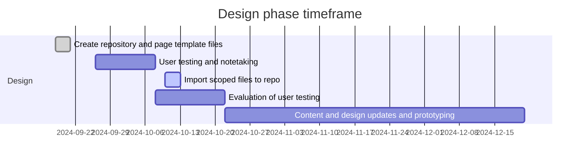
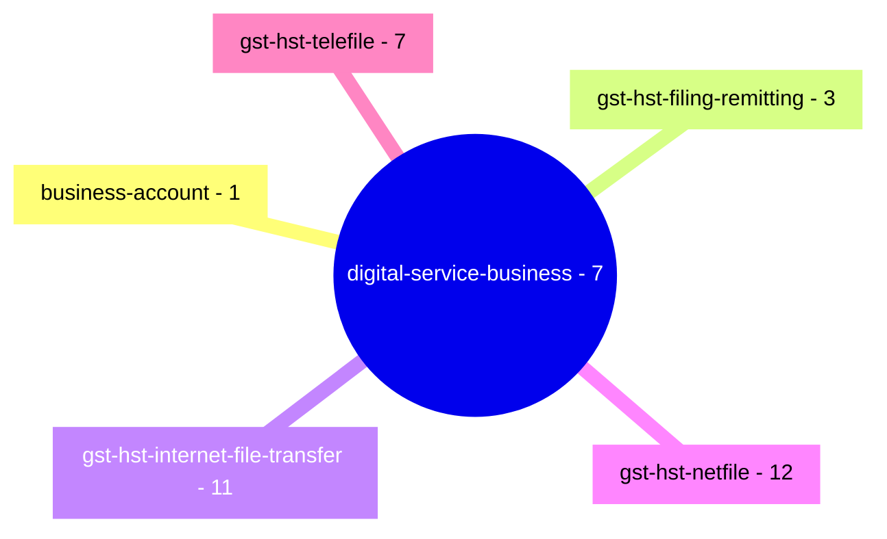

# GST/HST for Small Business [COP FY2024]

Project to optimize the content related to filing GST/HST returns.

**COP Timeframe:** [July 31, 2024 - February 2025]

## Important links

- Prototype live site : [File a GST/HST return, rebate or election electronically](https://cra-proto.github.io/gst-hst-business/en/file-a-gst-hst-return-rebate-election-electronically.html)
- Scoped GST COP page list: [GST/HST for Business - scoping](https://122gc.sharepoint.com/sites/WOSCoordination/Lists/GSTHST%20for%20business%20COP%20%20scoping/AllItems.aspx?env=WebViewList&viewid=1379b8f8-af3b-47fb-ba50-29a24ea1d13d&useFiltersInViewXml=1&OR=Teams-HL&CT=1726666893920&clickparams=eyJBcHBOYW1lIjoiVGVhbXMtRGVza3RvcCIsIkFwcFZlcnNpb24iOiI0OS8yNDA4MTcwMDQxOSIsIkhhc0ZlZGVyYXRlZFVzZXIiOmZhbHNlfQ%3D%3D)
- [Github Canada.ca page template \(CDTS\)](https://github.com/cra-proto/gst-hst-business/blob/main/templates/page_template-e.html)
- [Github Canada.ca page template \(Jekyll\)](https://github.com/cra-proto/gst-hst-business/blob/main/templates/page_template_jekyll-en.html)

## Update procedures:
- Test development files will be have `_proto#` appended to the end of the file name.
- Changes will be committed by `create a new branch` and then performing a pull request to merge the changed content.
- Updates should have comments identifying the change.
- Any repository path structure changes should be communicated to all indivdual updating the repository.
---

## Deleted files list
- None

## Design phase roadmap:
- [ ] Prototype: co-design navigation and content
- [ ] SME review and accuracy check
- [ ] Validation usability testing (including accessibility review)
- [ ] Refine prototype (if required)
- [ ] Spot check usability (if required)


\* future dates may be placeholders.

## Canada.ca path structure: 
[https://www.canada.ca/en/revenue-agency/services/e-services/digital-services-businesses/](https://www.canada.ca/en/revenue-agency/services/e-services/digital-services-businesses/)



## GCWeb Jekyll page template example:

```jekyll
---
layout: default                                    # Available: default, fluid, layout-home, no-container, wothout-h1
title:  [The title of the current page]            # This value will set the title and h1 tag
lang:   [en | fr]                                  # Either "en" or "fr"
dateModified: [2024-99-99]                         # ISO date
description: [Description of the current page]     # Metadata description
breadcrumbs:                                       # By default the Canada.ca crumbs is already set
  - title: "[The title]"
    link:  "[The url]"
altLangPage: "#"                                   # Optional. Use the url of the alternate language page to display the language toggle
pageclass: cnt-wdth-lmtd                           # Optional. You can use "cnt-wdth-lmtd" to limit the lenght of content lines to 65 characters
css: [https://domain.ca/your-stylesheet.css]       # Optional. You can add custom css to your page
script: [https://domain.ca/your-awesome-script.js] # Optional. You can add custom javascript to your page
---

<p>Content that would be displayed on the page</p>
```

## Resources

- [Jekyll theme for GCWeb](https://github.com/wet-boew/gcweb-jekyll)
- [Centrally Deployed Templates Solutions \(CDTS\) - Internet](https://cenw-wscoe.github.io/sgdc-cdts/docs/internet-nodocwrite-en.html)
- [User Centered Design Guide](https://design.cra-arc.alpha.canada.ca/en/index.html)
- [Mermaid markdown documentation](https://mermaid.js.org/intro/getting-started.html)

**Updated:**  2024-09-20
