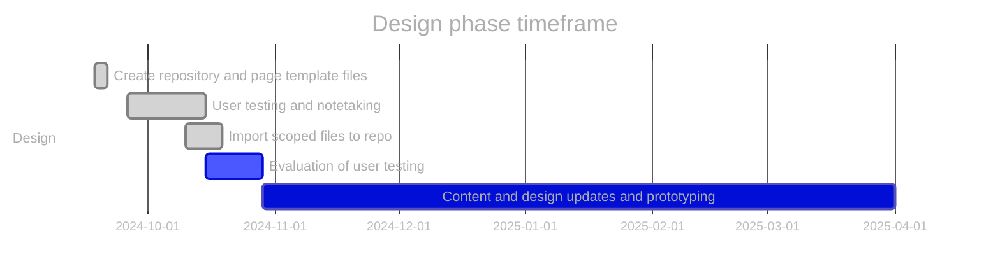
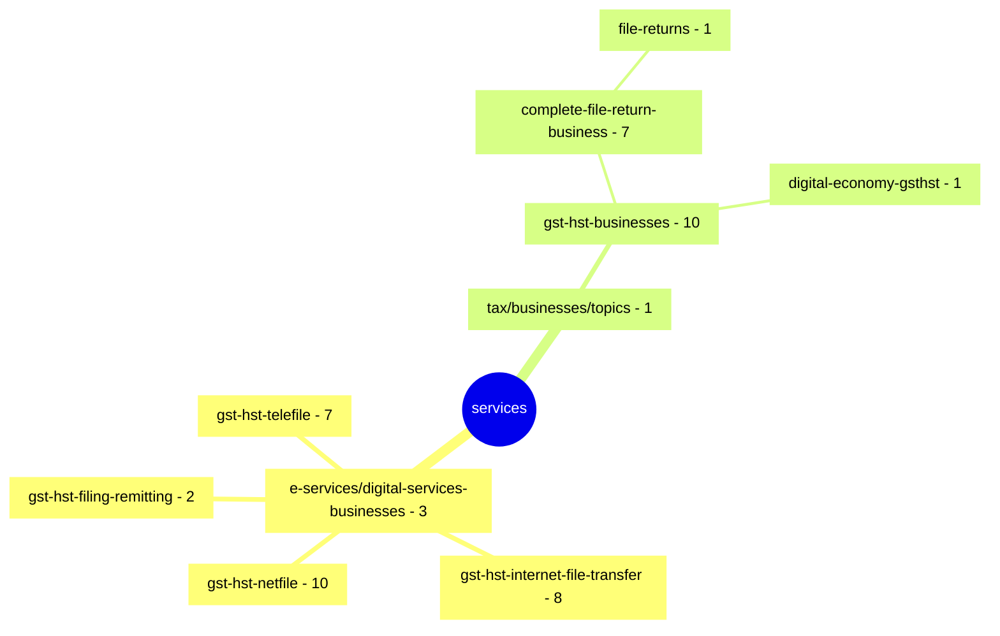

# GST/HST for Small Business [COP FY2024]

Project to optimize the content related to filing GST/HST returns.

**COP Timeframe:** [July 31, 2024 - February 2025]

## Important links

- [Support information](https://github.com/cra-design/gst-hst-business/blob/main/docs/SUPPORT.md)
- [Privacy statement](https://github.com/cra-design/gst-hst-business/blob/main/docs/PRIVACY.md)
- [\[GST COP\] Scoped inventory page \(github\)](https://cra-design.github.io/gst-hst-business/index.html)
- [Github.dev](https://github.dev/cra-design/gst-hst-business/blob/main/)
- [Github Canada.ca page template \(Jekyll\)](https://github.com/cra-design/gst-hst-business/blob/main/templates/page_template_jekyll-en.html)
- [Github Canada.ca page template \(CDTS\)](https://github.com/cra-design/gst-hst-business/blob/main/templates/page_template-e.html)
- [Github Canada.ca page template with login \(CDTS\)](https://github.com/cra-design/gst-hst-business/blob/main/templates/page_template_login-e.html)

## Update procedures:

- Test development files will have `_proto#` appended to the end of the file name
- Changes will be committed by selecting `create a new branch` and then performing a `pull request` to merge the updated content
- Updates should be named or have comments identifying what has been updated or changed
- Any repository path structure changes should be communicated to all indivduals who directly update the repository
- There should be no relative links on any pages so all links should be made absolute
- Create all files in locations that reflects where they will be eventually published when created on Canada.ca
- In the [_config.yml](https://github.com/cra-design/gst-hst-business/blob/main/_config.yml) file the `developerOptions:` setting should be changed to `false` before testing takes place

## Custom page template options

- The `Edit button` on the banner toggles **contenteditable** on and off allowing editing of the live page **Note:** Any changes made are not saved and will be lost if navigated off the page or the browser tab is closed or refreshed
- The `Github button` on the banner will take you to the the source page on github  
- All pages links and forms that direct outside of the repository to will automatically be replaced with links to the **exit intent page**
  - The data attribute `data-exit="false"` can be used on `<a>` and `<form>` tags directed outside of the github domain so that replacement links are not generated to direct them automatically through the **exit intent page**
- The option `sourceurl` in the **YAML** section of the page code allows you to add URLs (settings the **link** and **title**) that will appear in the banner for easy navigation to pages you deem relevant to add
- Additional custom `layout` options that are available in the **YAML** section of the page code are:
  - `no-test-banner` - removes the top banner from the page
  - `without-h1-test-banner` - removes the top banner and the h1 for the page is not automatically generated

Additional site wide setting information can be found in the [Support information](https://github.com/cra-design/gst-hst-business/blob/main/docs/SUPPORT.md) readme file

---

## Added/Modified/Deleted files and pages to be published:
|Change|Github page|Canada.ca|
|:-:|:-|:-|
||[After you file](https://github.com/cra-design/gst-hst-business/blob/main/en/topics/gst-hst-businesses/proto_file-return-business_subway/after-file_proto1.html)||
||[GST/HST for businesses](https://github.com/cra-design/gst-hst-business/blob/main/en/topics/gst-hst-businesses_proto1.html)||
||[Penalties for GST/HST returns](https://github.com/cra-design/gst-hst-business/blob/main/en/topics/gst-hst-businesses/proto_file-return-business_subway/penalties-interest_proto1.html)||
||[Remit (pay) the GST/HST you collected](https://github.com/cra-design/gst-hst-business/blob/main/en/topics/gst-hst-businesses/pay-when_proto1.html)||
||[Before you file](https://github.com/cra-design/gst-hst-business/blob/main/en/topics/gst-hst-businesses/proto_file-return-business_subway/before-file_proto2.html)||
||[Calculate and prepare to report the GST/HST](https://github.com/cra-design/gst-hst-business/blob/main/en/topics/gst-hst-businesses/prepare-your-return_topic_proto1.html)||
||[Choose a filing method - File your GST/HST return](https://github.com/cra-design/gst-hst-business/blob/main/en/topics/gst-hst-businesses/proto_file-return-business_subway/choose-your-filing-method_proto4.html)||
||[Contact us](https://github.com/cra-design/gst-hst-business/blob/main/en/topics/gst-hst-businesses/proto_file-return-business_subway/contact-filing_proto1.html)||
||[File your GST/HST return](https://github.com/cra-design/gst-hst-business/blob/main/en/topics/gst-hst-businesses/file-return-business_subway_proto1.html)||
||[GST/HST access codes](https://github.com/cra-design/gst-hst-business/blob/main/en/topics/gst-hst-businesses/proto_file-return-business_subway/using-methods_proto1/gst-hst-access-codes_proto1.html)||
||[How to file](https://github.com/cra-design/gst-hst-business/blob/main/en/topics/gst-hst-businesses/proto_file-return-business_subway/using-methods_proto1.html)||
||[How to file and remit though a financial institution](https://github.com/cra-design/gst-hst-business/blob/main/en/topics/gst-hst-businesses/proto_file-return-business_subway/using-methods_proto1/gst-hst-edi-onepager_proto1.html)||
||[How to file by phone \(TELEFILE\)](https://github.com/cra-design/gst-hst-business/blob/main/en/topics/gst-hst-businesses/proto_file-return-business_subway/using-methods_proto1/gst-hst-telefile-onepager_proto1.html)||
||[How to file using the online NETFILE form](https://github.com/cra-design/gst-hst-business/blob/main/en/topics/gst-hst-businesses/proto_file-return-business_subway/using-methods_proto1/gst-hst-netfile-onepager_proto1.html)||
||[How to file using third-party accounting software](https://github.com/cra-design/gst-hst-business/blob/main/en/topics/gst-hst-businesses/proto_file-return-business_subway/using-methods_proto1/gst-hst-ift-onepager_proto1.html)||
||[In your CRA account (using NETFILE)](https://github.com/cra-design/gst-hst-business/blob/main/en/topics/gst-hst-businesses/proto_file-return-business_subway/using-methods_proto1/gst-hst-cra-account-onepager_proto1.html)||
||[Instructions for completing a GST/HST return](https://github.com/cra-design/gst-hst-business/blob/main/en/topics/gst-hst-businesses/prepare-your-return_topic_proto1/return-instructions_proto1.html)||
||[Leftover completing info (to be placed)](https://github.com/cra-design/gst-hst-business/blob/main/en/topics/gst-hst-businesses/proto_file-return-business_subway/leftover-completing-info_proto1.html)||
||[Paper filing](https://github.com/cra-design/gst-hst-business/blob/main/en/topics/gst-hst-businesses/proto_file-return-business_subway/using-methods_proto1/gst-hst-paper-filing-onepager_proto1.html)||
||[Software for GST/HST Internet File Transfer](https://github.com/cra-design/gst-hst-business/blob/main/en/topics/gst-hst-businesses/proto_file-return-business_subway/using-methods_proto1/gst-hst-ift-software_proto1.html)||
||[Who must complete a return](https://github.com/cra-design/gst-hst-business/blob/main/en/topics/gst-hst-businesses/prepare-your-return_topic_proto1/who-must-file_proto1.html)||
||[Complete and file a GST/HST return](https://www.canada.ca/en/revenue-agency/services/tax/businesses/topics/gst-hst-businesses/complete-file-return-business.html)||
||[Feedback](https://www.canada.ca/en/revenue-agency/services/e-services/digital-services-businesses/gst-hst-netfile/gst-hst-netfile-feedback.html)||
||[Remit (pay) the tax you collected – Check My Business Account](https://www.canada.ca/en/revenue-agency/services/tax/businesses/topics/gst-hst-businesses/pay-check-balance.html)||
||[Remit (pay) the tax you collected – Correct a payment](https://www.canada.ca/en/revenue-agency/services/tax/businesses/topics/gst-hst-businesses/pay-correct-payment.html)||
||[Remit (pay) the tax you collected - When to remit (pay)](https://www.canada.ca/en/revenue-agency/services/tax/businesses/topics/gst-hst-businesses/pay-when.html)||
## Design phase roadmap:

- [ ] Prototype: co-design navigation and content
- [ ] SME review and accuracy check
- [ ] Validation usability testing (including accessibility review)
- [ ] Refine prototype (if required)
- [ ] Spot check usability (if required)

\* future dates may be placeholders.

## Canada.ca path structure of scoped files

[https://www.canada.ca/en/revenue-agency/services/](https://www.canada.ca/en/revenue-agency/services/e-services/digital-services-businesses/) \[50 pages\]

**Updated:**  2025-02-07
