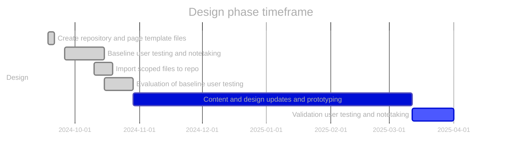

# Design phase roadmap:

- [x] Prototype: co-design navigation and content
- [x] SME review and accuracy check
- [x] Validation usability testing (including accessibility review)
- [ ] Refine prototype (if required)
- [ ] ~~Spot check usability (if required)~~

\* future dates may be placeholders.